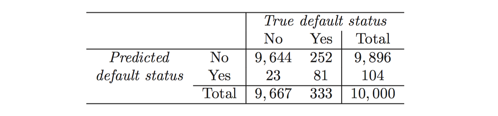

```{r setup, include=FALSE}
knitr::opts_chunk$set(echo = TRUE)
```

Please read chapter 4 of [Introduction to Statistical Learning](http://www-bcf.usc.edu/~gareth/ISL/index.html) in R.

```{r}
library(dplyr)
library(ggplot2)
library(corrplot)

```


### 1 

Example of confounding. Use mtcars and show confounding between any 2 of the variables

```{r fig.height= 6, fig.width= 6}

data("mtcars")

mtcars %>% 
    cor(.) %>% 
    corrplot(method="color", tl.col="black")

```

Here we can see `wt` is highly negatively correlated with `am`

```{r}

names(mtcars)

```


```{r}

mtcars %>% 
    lm(mpg ~ am, .) %>% 
    coef()

```

```{r}


mtcars %>% 
    lm(mpg ~ wt + am, .) %>% 
    coef()

```

Notice the sign flip in `an`. 

`wt` confound the relationship between `mpg` and `am`. 

### 2 

Give 3 reasons why LDA could perform better than logistic regression

- When the classes are well-separated, the parameter estimates for the logistic regression model are surprisingly unstable. Linear discrimi- nant analysis does not suffer from this problem.

- If _n_ is small and the distribution of the predictors X is approximately normal in each of the classes, the linear discriminant model is again more stable than the logistic regression model.

- Linear discriminant analysis is popular when we have more than two response classes.

### 3

_Hint: see section 4.4.2_

- What is the theoretical error rate for LDA?

σ

- Why is this true? (Hint: how does it compare to a Bayes Classifier)

The LDA classifier results from assuming that the observa- tions within each class come from a normal distribution with a class-specific mean vector and a common variance σ2, and plugging estimates for these parameters into the Bayes classifier.

### 4

Since real world data does not provide mu or sigma, how does LDA estimate them. _(hint: provide the formula for each and provide a 2 sentence description)_


The estimate for μk is simply the average of all the training observations from the kth class, while σˆ2 can be seen as a weighted average of the sample variances for each of the K classes.

### 5

You will find a confusion matrix on page 145:



- What does the number 81 tell you?

> True Positives. There are 81 obs defaulted that were also predicted by the model. 

- What does the number 23 tell you?

> False Positives. There are 23 obs didn't default but predicted as default. 

- What does the number 9896 tell you?

> True Negatives. There are 9896 obs that didn't default waere also predicted as not default

- What does the number 252 mean?

> False Negatives. There are 252 obs that did default but got predicted otherwise (as No)

### 6

If the posterior probability of default is computed as 0.51 is a person classified as in the default class or not?

By default, yes, but that also has to be dependent on what threshold we decide to use. 

### 7

How many people are incorrectly classified if we lower the posterior probability of default=Yes to 20%

`false positive` + `false negative` = 235 + 138 = `r 235 + 138`

### 8

When is QDA use recommended _(see section 4.5)_? Hint: there are 2 simple reasons.

1). Unlike LDA, QDA assumes that each class has its own covariance matrix. 

2). QDA can perform better in the presence of a limited number of training observations because it does make some assumptions about the form of the decision boundary.

### 9

Write a short essay of about 4-5 sentences:

- Your input dataset contains 1 million observations (i.e. 694 days) of from a temperature sensor. The sensor is sampled and recorded every minute.
- You are asked to create a prediction model
- What would you use, and explain why you choose your approach?

I will use linear regression. Predict temperature is not a classification task. The response here is continous (and even time-series dependent), therefore, a linear regression would be the recommendation. 

Linear regression
Logistic regression
LDA
QDA

### 10

Write a short essay of about 4-5 sentences:

- 100 people are sampled as they exit a movie. They are asked 12 questions to characterize the movie.
- You are asked to predict, based on these characterizing factors, if the movie appeals to women or men.
- What would you use and explain why?

I will use logistic regression, because this is a classification tasks, because the response here is a binary yes/no. Logistic regression is better than linear regression. 

logistic regression
linear regression

### 11

Write a short essay of about 4-5 sentences:

- A global retail store purchases a certain brand of shirt from multiple sources. They sell 1000’s of this shirt per year.
- Previous investigation reveals that there is high variance in quality between any source.
- You are asked to predict if a given shipment is counterfeit or not

What would you use and explain why?

LDA, when the varaince is not drawn from a normal distribution and also high. LDA is better because its estimate of the parameters is more stable. 

Linear regression
LDA
QDA
Logistic regression

# 12

Write a short essay of about 4-5 sentences:

- 100 Women and 25 men are sampled as they exit a movie. They are asked 12 questions to characterize the movie.
- You are asked to predict, based on these characterizing factors, if the movie appeals to women or men.

What would you use and explain why?

QDA, because now we have a small amount of training set. QDA can perform better in the presence of a limited number of training observations because it does make some assumptions about the form of the decision boundary.


logistic regression
linear regression
LDA
QDA